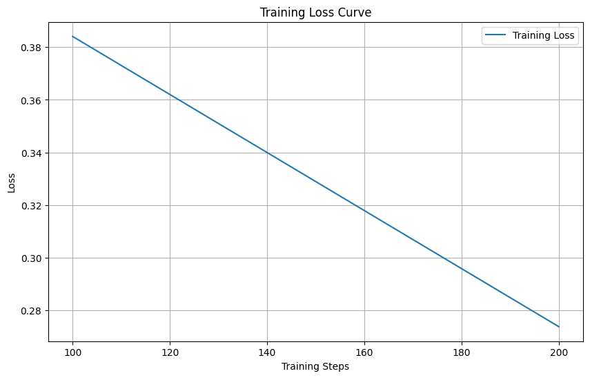

# Fine-Tuning Mistral-7B for Advanced Text-to-SQL Generation

This project demonstrates a comprehensive workflow for fine-tuning the state-of-the-art **Mistral-7B** large language model to function as a powerful Text-to-SQL assistant. The goal is to transform natural language questions into precise, executable SQL queries.

The entire process, from data preparation to model training and evaluation, is performed using QLoRA for memory-efficient fine-tuning, making it possible to train on a single consumer-grade GPU (like Google Colab's T4).

---

## 🚀 Key Features

*   **State-of-the-Art Model**: Leverages the powerful **Mistral-7B**, known for its strong reasoning and language understanding capabilities.
*   **Efficient Fine-Tuning**: Employs **QLoRA (4-bit quantization)** to drastically reduce memory requirements, enabling fine-tuning on a 16GB VRAM GPU.
*   **High-Quality Dataset**: Trained on a subset of the `b-mc2/sql-create-context` dataset, a variant of the well-regarded Spider dataset.
*   **Complex Query Handling**: The fine-tuned model is capable of generating complex SQL queries that include `JOIN`s, `GROUP BY` clauses, and aggregate functions.
*   **Reproducible Workflow**: The project is fully documented in a Jupyter Notebook, providing a step-by-step guide to reproduce the results.

---

## 🛠️ Tech Stack & Libraries

*   **Primary Framework**: Python, PyTorch
*   **Hugging Face Ecosystem**:
    *   `transformers`: For model and tokenizer loading.
    *   `peft`: For implementing Parameter-Efficient Fine-Tuning (PEFT) with LoRA.
    *   `accelerate`: For hardware optimization.
    *   `bitsandbytes`: For 4-bit quantization.
    *   `datasets`: For efficient data loading and processing.
*   **Environment**: Google Colab (with T4 GPU)
*   **Plotting**: Matplotlib

---

## 📊 Training Process

The full `b-mc2/sql-create-context` dataset contains approximately 78,000 examples. Initial tests on the full dataset with a Google Colab T4 GPU showed an estimated training time of over 150 hours, which was not feasible for this project.

To demonstrate the fine-tuning workflow effectively and achieve a strong proof-of-concept, a smaller, random subset of **1,000 examples** was used for training. This practical decision reduced the training time to a manageable **~2-3 hours** while still yielding a highly capable Text-to-SQL model.

The model was fine-tuned with the following configuration:

*   **Base Model**: `mistralai/Mistral-7B-v0.1`
*   **Dataset**: `b-mc2/sql-create-context` (using a 1,000-example subset)
*   **Fine-Tuning Method**: QLoRA
*   **LoRA Rank (`r`)**: 16
*   **LoRA Alpha (`lora_alpha`)**: 32
*   **Batch Size**: 4
*   **Epochs**: 1
*   **Optimizer**: PagedAdamW (8-bit)
*   **Learning Rate**: 2e-4

### Training Loss Curve

The training process showed a consistent decrease in loss, indicating that the model was successfully learning the patterns of SQL generation from the provided examples.



---

## ⚙️ Usage

To get this project running locally:

**1. Clone the repository:**
```bash
git clone https://github.com/prakashjha1/mistral-sql-finetuning.git
cd mistral-sql-finetuning
```
## 💡 Example Usage & Results
**Here are a few examples demonstrating the model's capability to convert complex natural language questions into SQL.**

Example : Simple Aggregation

Database Schema: CREATE TABLE head (name TEXT, age INTEGER, city TEXT)

Question: "How many heads of the departments are older than 56?"

**Generated SQL:**
```
SELECT count(*) FROM head WHERE age > 56
```
